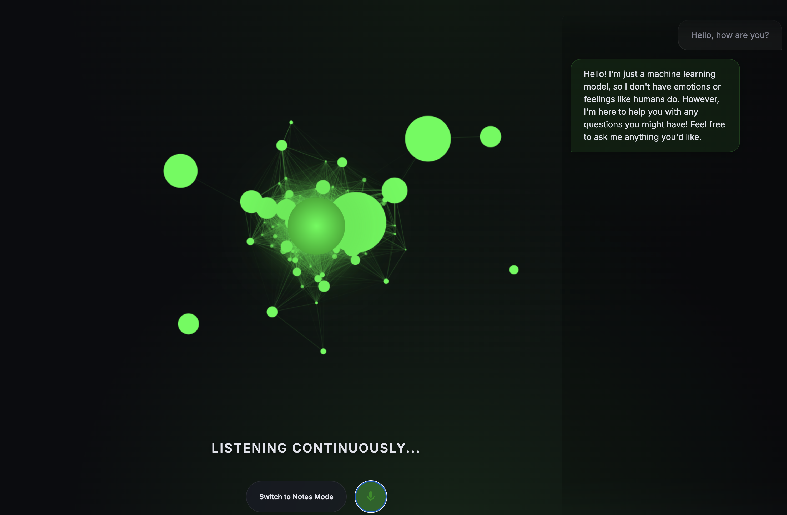

# Jarvis The Butler 🎩

A blazingly fast, localized, continually-listening voice assistant built dynamically for macOS using Apple Metal acceleration and HTML5 Canvas.


*(Please rename your uploaded screenshot to `screenshot.png` and place it in this folder so it appears here!)*

## 🚀 Features

- **Blazingly Fast Local Inference:** Powered locally by `Ollama` running `qwen2.5:0.5b` (utilizing macOS Metal / AMD discrete graphics) and `Whisper (tiny.en)` transcriber running effortlessly on the CPU.
- **Continuous Voice Activity Detection (VAD):** The frontend listens constantly. It intelligently slices and transmits your voice upon detecting 2 seconds of silence, without you ever having to press a button again.
- **Matrix-Themed 3D Node Graph:** A highly complex HTML5 Canvas visualization featuring 120 individually calculated nodes moving with a beautiful 3D parallax effect.
    - *Listening State:* Nodes float organically with subtle friction.
    - *Processing State:* Nodes glow brightly and get sucked into a dense gravitational core before exploding outward when complete.
- **Meeting Notes Mode:** Switch modes at the click of a button! During a meeting, Jarvis continuously slices background audio to silently feed the AI, producing an ongoing event ledger without ever interrupting the conversation. When stopped, a compiled Markdown meeting summary is generated.
- **Asynchronous Chat Sync:** The backend instantly beams conversational replies back to the UI before queuing the synchronous macOS text-to-speech engine, making the chat incredibly responsive.

## 🛠 Prerequisites

1. **Python 3.10+**
2. **Ollama:** With the Qwen model pulled (`ollama pull qwen2.5:0.5b`)
3. **OpenAI Whisper:** Locally installed
4. **macOS:** For the built-in `say` terminal command (defaults to the 'Daniel' voice).

## ⚡️ Quickstart

1. Clone or clone the repository and navigate to the project directory:
   ```bash
   cd jarvisTheButler
   ```

2. Install python dependencies:
   ```bash
   pip install flask openai-whisper torch
   ```

3. Run the application:
   ```bash
   python3 app.py
   ```

4. Open your browser to `http://127.0.0.1:5000`.

## 🎮 How to Use

- **Start Chatting:** Click the **green microphone button** to start continuous listening. Speak naturally, and wait for 2 seconds of silence. The assistant will answer vocally while automatically muting its microphone.
- **Meeting Notes:** Click the **"Switch to Notes Mode"** toggle, and hit start. The assistant will silently compile concise meeting bullet points into your chat ledger. Simply click the microphone icon again to finish the meeting and compile your master list!

---
*Built with ❤️ in Flask, Python, and Vanilla JavaScript.*
